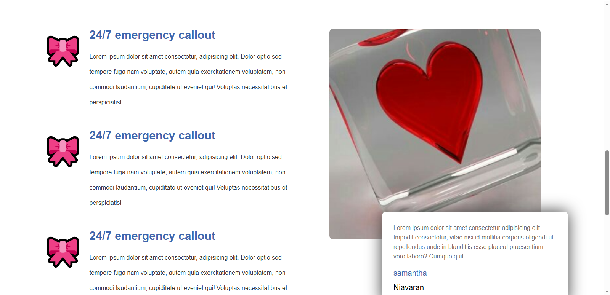
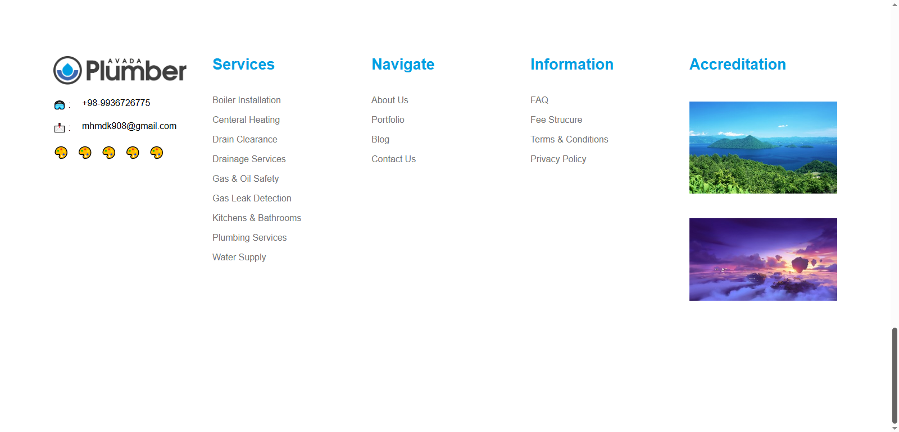
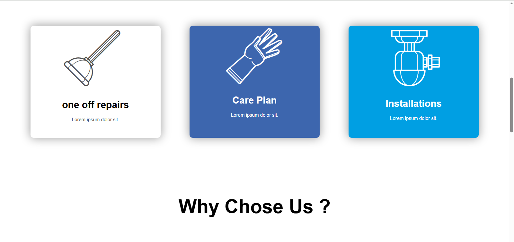
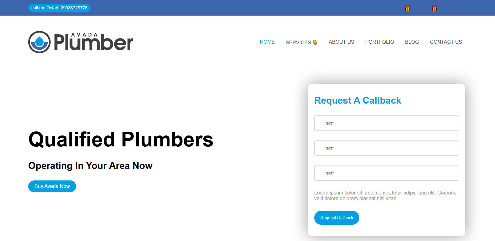

# 🌐 My First Project

A simple and responsive website built with **HTML5** and **CSS3** as part of my web development learning journey.

## 🚀 live Demo

🔗 **View Online:**
https://mhmdkbyry908-art.github.io/my-first-project/

---

## 📸 Project Preview

<p align="center">
  
  
</p>

<p align="center">
  
  
</p>
---

## ✨ Features

- Responsive Design 📱💻
- Clean and Modern UI 🎨
- Built with Pure HTML & CSS
- Beginner-Friendly Structure
- Fast Loading Performance ⚡

---

## 🛠️ Technologies Used

- HTML5
- CSS3
- Git
- GitHub Pages

---

## 📚 What I Learned

During this project I practiced:

- Semantic HTML structure
- CSS styling and layouts
- Responsive web design
- Git & GitHub workflow
- Deploying websites using GitHub Pages

---

## 📂 Project Structure

```text
my-first-project/
│
├── index.html
├── style.css
├── assets/
│   ├── images/
│   └── icons/
│
└── README.md# my-first-project
first project front-end
